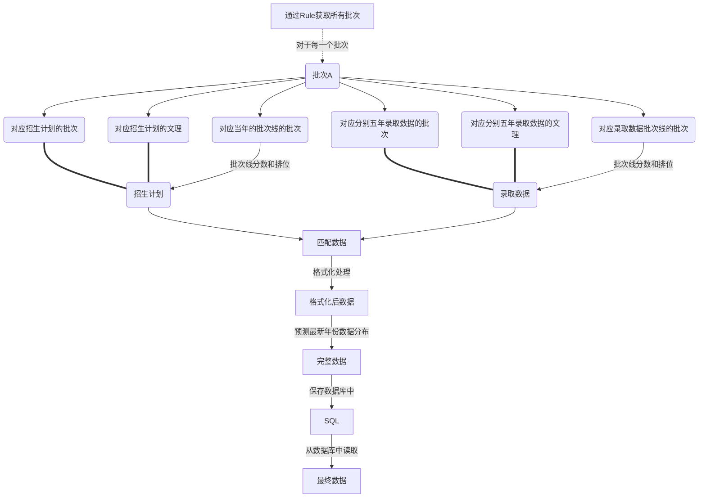

# 志愿推荐系统    
旧版已弃用，可参考GaoKao2020/和GaoKao2021/文件夹下Readme。
## 推荐志愿生成2022年版
### 文件结构
```
GaoKao2022/
    log/                存放日志文件
    Predict/            预测功能接口实现
    Predict2022/        预测新一年分数的具体实现
    PredictProb2022/    预测新一年概率的具体实现
    Rule/               高考志愿规则
        data/pro...csv      高考志愿原始文件
        creat_base.py       将规则写入数据库中的具体实现
    SQL/                查表连表主要功能实现
        base.py             基础功能，设定各种字段和关键值、表名等
        batch_util.py       处理批次匹配相关功能的具体实现
        collegeinfo_util.py 获取院校信息的功能实现
        demand_util.py      处理选科要求及预测时筛选的功能实现
        merge_util.py       数据联表——将招生计划和招生记录匹配起来的相关内容
        rule_util.py        获取志愿规则以及配置今年年份、使用的历史记录年份
        setting.py          SQL配置
        sf_util.py          省控线及对应排名的功能实现
        spname_util.py      专业之间匹配功能的实现
        sql_util.py         对数据库的直接增删改操作处理实现
        to_excel.py         导出排行榜相关
        wenli_util.py       文理选科要求匹配的功能实现
    Util/               其他工具类函数
        logging.py          日志的保存
        province_id.py      省份和id的相互转换工具
    main.py             整体流程
    __init__.py         接口的具体调用
    
app/            API相关
    main/
        __init__.py         具体的API定义
    templates/
        login.html          登录页面
        index.html          主页面
        admin.html          管理页面
        log.html            日志页面
    .....
```
### API清单  
此处列出所有可用API及功能简述，具体参数和返回值在下文[API详情]中查看    
- [POST] /findCollege    院校或专业的概率
- [POST] /findBatchInfo  获取该批次的高考规则及库中批次匹配信息
- [POST] /findCollegeProb 测一测院校概率
- [GET] /findSplit       获取冲稳保的划分条件
- 
- [POST] /startAll       初始化(将数据从sql读进redis)所有省份数据
- [POST] /startProvince  初始化指定省份的数据
- [POST] /updateProvince 更新指定省份的志愿数据
- [POST] /updateAll      更新所有省份的数据
- [POST] /findLogProvince 获取指定省份的日志
- [GET] /findProvinceStat 获取所有省份的志愿数据状态
- 
- [POST] /deltable        删除所有本程序创建的table并清空内存中数据
- [POST] /delRuleTable    根据文件重建Rule表格

### 处理流程
#### 每个省份的数据处理流程

#### 部署流程
```shell
CMD ["/bin/sh","-c","./run.sh"]
```
```mermaid
graph 
A[sh ./run.sh]-->AB[启动redis服务]-->B[根据环境选择启动dev.sh或prod.sh]
B-->C[启动restart.sh]===CC(延迟请求接口/startAll)
B-->D[使用gunicorn部署flask项目]
D-->E[初始化Redis]
E.->|收到start请求后|F[将数据从MYSQL读进redis]
E.->|收到update请求后|G[重新生成数据存进MYSQL表中并读进redis]
```


### API详情
- [POST] /findCollege
```
获取某省份某批次某文理的院校或专业组或专业的概率

[参数]
province_id: 省份id, 1-30
wenli: wenli，0/1/2/21/22
score: 分数
rank: 排名
# 批次
batch_text: 标准批次,默认""        \\
batch_plan: 招生计划批次,默认""      这三个中须至少有一个非空
batch_fsx: 批次线中的批次,默认""    //
# 筛选项，以下项默认值为空列表时均不筛选
college_id: 院校id,默认-1,like 1 数字类型
city_id: 城市id列表，默认[]
major_code_2: 专业方向二级学科code列表, 默认[], like ['0503','0504'] str类型列表
nature_code: 学校性质代码列表,默认[], like [1,2,3] 数字类型列表
first_code: 大学特色代码列表,默认[], like [985, 211, 1, 2, 3], 其中数字与firstrate字段对应，数字类型列表
type_code: 大学类型筛选,默认[], like [1,2,3,4] 数字类型列表
demand: 选科，默认[],like ["生物", "化学"] str类型列表
query: 校名或专业名筛选，like "北京", "中药", str类型
# debug项
detail: 是否返回详细数据（用于演示系统），默认false
sg_name: 筛选sg_name，只有专业组省份生效(用于演示系统)


[Response]
[院校]
{
    "mode": 'school',
    "data":[
        {
            "id": 1799,     # id为school表中索引
            "cid": 666,
            "prob": 0.0,
            "cl_sg": "1_1001_",
            "r": 100.01,
            "pid": 1, 
        },
        ...
    ]
}

[专业模式]
{
    "mode": 'sp',
    "data":[
        {
            "id": 6666,     # id为sp表中索引
            "cid": 666,
            "prob": 0.0, 
            "cl_sg": "1_1001_01",
            "r": 100.01,
            "pid": 1, 
        },
        ...
    ]
}

[专业组模式]
{
    "mode": 'sp',
    "data":[
        {
            "id": 6666,     # id为sp表中索引
            "cid": 666,     # college_id    
            "prob": 0.0,    # 概率
            "cl_sg": "1_1001_01",  # college_id、school_code和sg_name的拼接值
            "r": 100.01,    # predict_rank
            "pid": 1,       # 院校所处的省份id
        },
        ...
    ]
}

```

- [POST] /findBatchInfo
```
  获取不同表之间批次名称的对应信息
 [参数]
 province_id: 省份id
 
 [Response]
 {
    batch_info:[
        {
            'enable': true,                 该批次是否可用
            'batch_norm': "本科一批",         整理后的批次名称
            'batch_plan': ["本科一批"],       招生计划中的批次名称们
            'batch_fsx': "本科一批A类",       分数线中的批次名称
            'mode': "school",               school/sp/group
            'goal_years': 2021,             用的哪年的招生计划和批次线
            'gaozhi': 0,                    是否高职，对应fsd中的cengci
            'cengci': 1,                    本科批1还是专科批2的，0代表混合批次
            'num_school': 8,                志愿表学校/专业组数量
            'num_sp': 6,                    志愿表专业数量
            'wenli': 12,                    0/12/212   
        },
        {
            'batch_norm': "本科一批B"，
            'enable': false
        },
        ...
    ]
 }
```
- [POST] /findCollegeProb 测一测院校概率
```
测一测院校录取概率
[参数]
province_id: 省份id, 1-30
wenli: wenli，0/1/2/21/22
score: 分数
rank: 排名
college_id: 院校id
batch_text: 标准批次,默认""        \\
batch_plan: 招生计划批次,默认""      这三个中须至少有一个非空
batch_fsx: 批次线中的批次,默认""    //
[Response]
{
    "plan_year": int, 招生计划年份
    "college_prob": float, 院校最大录取概率, -1表示未知
    "type": str, 'chong'/'wen'/'bao'/'-' , '-'表示未知
}
```
- [GET] /findSplit       获取冲稳保的划分条件
```
获取冲稳保的划分条件
[返回]
{
    "c": 0.15,
    "cw": 0.7,
    "wb“： 0.97
}
```
- [POST] /startAll       
```
将指定省份数据从sql读进redis
[参数]top/end
从top到end省份，默认1-30
```
- [POST] /startProvince
```
将指定省份的数据从sql读进redis
```
- [POST] /updateProvince
```
强制更新指定省份的数据，即便sql中已经存在，建议并行不超过CPU核数-1个，不然容易卡住
```
- [POST] /updateAll
```
强制更新所有未运行省份的数据
[参数]top/end
更新从top到end省份，默认1-30
```
- [POST] /findLogProvince 
```
获取指定省份的日志
province_id: 省份id
return:
    {'log': text}
获取指定省份的更新日志
```
- [GET] /findProvinceStat 
```
获取所有省份的志愿数据状态
[return]
{
    "1":{
            "batch_ok": ["本科批", "专科批"],             准备就绪的批次
            "batch_fail": [],                           无法预测的批次
            
            "init": true,                               true/false 是否从sql读进redis
            "initing": false,                           true/false 是否正在读取sql    
            "create": true,                             true/false 未曾创建失败
            "creating": false,                          true/false 是否正在生成
            
            "province_id": 1
            "province": "北京"
    
    },
    ...
}
```
- [POST] /deltable
``` 
- 删除所有本程序创建的table并清空内存和redis中数据
```

- [POST] /delRuleTable
``` 
- 仅仅删除Rule表并根据文件重建
```

## 环境变量
| 字段 | 含义 |
|:-:|:-:|
|TOKEN| | 
|USERNAME|演示系统的账号 | 
|PASSWORD |演示系统的密码 |
|MYSQL_HOST |数据库连接 |
|MYSQL_PORT | |
|MYSQL_USER | |
|MYSQL_PASSWORD | |
|MYSQL_DB |数据表所在database |
|MYSQL_DB_PLANSCHOOL|ga_zy_college_plan表对应的database,如果和MYSQL_DB一样，则可以省略，下同|
|TABLE_PLANSCHOOL|ga_zy_college_plan表对应的table名,如果也是ga_zy_college_plan，则可以省略，下同|
|MYSQL_DB_PLANSP|ga_zy_specialplan对应|
|TABLE_PLANSP||
|MYSQL_DB_DATASCHOOL|ga_zy_fsx_xx对应|
|TABLE_DATASCHOOL||
|MYSQL_DB_DATASP|ga_zy_fsx_zy对应|
|TABLE_DATASP|| 
|MYSQL_DB_FSX|ga_zy_fsx_sf对应|
|TABLE_FSX||
|MYSQL_DB_FSD|ga_zy_fsd对应|
|TABLE_FSD||
|MYSQL_DB_INFO|ga_zy_college对应|
|TABLE_INFO||
|MYSQL_DB_CITY|ga_city对应|
|TABLE_CITY||
|MYSQL_DB_MAJOR|ga_zy_major对应|
|TABLE_MAJOR||
|MYSQL_DB_GOAL|生成数据表所在database，默认同MYSQL_DB|
|TABLE_GOAL_RULE|生成的存放省份录取规则的表名，如果没有配置默认 algorithm_province_rule|
|TABLE_GOAL_SCHOOL|生成的存放院校信息的表名，如果没有配置默认 algorithm_zy_school|
|TABLE_GOAL_SP|生成的存放专业信息的表名，如果没有配置默认 algorithm_zy_sp|
|REDIS_IP| |
|REDIS_PORT||
|REDIS_PASS||
|REDIS_1||
|REDIS_2||
|REDIS_3||
|REDIS_4||
|REDIS_5||
|REDIS_6||
|REDIS_7||


